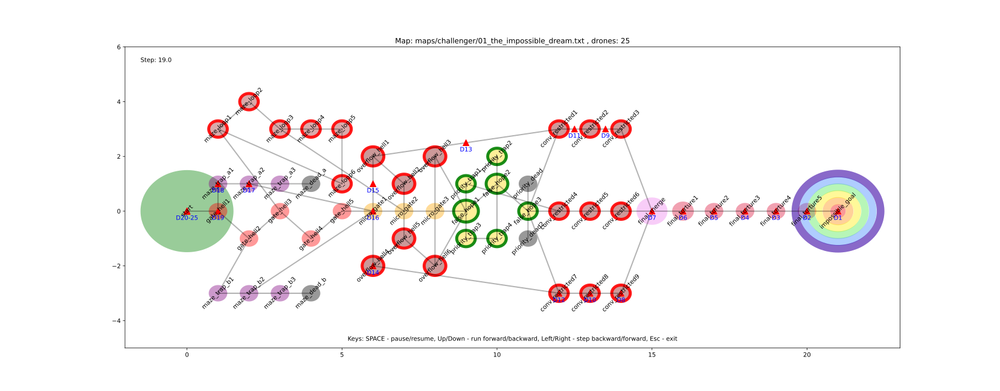

*This project has been created as part of the 42 curriculum by obachuri.*

---

# Fly-in - Drone Routing Simulation


This project is part of the 42.fr curriculum.

---

**The task - in the shortest time drive all given drones from the start point to the finish.**

We have a map - a graph where: 
Vertex (hub, zone, arrea) - plase where drones can be some time.
propetis:
- max_drones(default: 1) - Maximum drones that can occupy this zone simultaneously
- zone_type (normal, blocked, restricted, priority)

Edge (connection, link) - connection between two Vertices.
propetis:
- max_link_capacity(default: 1) - Maximum drones that can traverse this connection simultaneously

Each movement between hubs has a cost in turns, based on the zone_type of the destination hub:
- normal: 1 turn (default)
- restricted: 2 turns
- priority: 1 turn (but should be preferred in pathfinding algorithms)
- blocked: Inaccessible — cannot be entered

## Installation

```bash
make install
```

## Usage

```bash
# Run with map
make run my_map_file.txt
```

### Map File

Map file - a text file with map parameters and drone quantity.

Map file format:
```
# Comments start with '#'
nb_drones: <number>

start_hub: <name> <x> <y> [metadata]
end_hub: <name> <x> <y> [metadata]
hub: <name> <x> <y> [metadata]

connection: <hub1 name>-<hub2 name> [metadata]
```
`name` - Must be unique and cannot be empty or contain dashes or spaces. 

`number, x, y` - Positive integer. 

[metadata] is optional. All metadata tags must be enclosed in square brackets [...].

For hubs/zones/areas (start_hub, end_hub, hub) metadata could include the following:
- `zone=<type>` (default: normal) - one from the list: normal, priority, restricted, blocked
- `color=<value>` (default: none) - RGB or name of color - single-word strings (e.g., red, blue, gray)
- `max_drones=<number>` (default: 1) - Maximum drones that can occupy this zone simultaneously  

Zone type affecting movement cost. Possible zone types:
  - `normal` - Standard zone, 1 turn to enter (default)
  - `priority` - A preferred zone. 1 turn to enter but should be prioritized in pathfinding
  - `restricted` - Dangerous zone, **2 turns** to enter (drone wait one step on a link to the zone)
  - `blocked` - Inaccessible, drones cannot enter a zone with the type.

For links (connection) metadata:
- `max_link_capacity=<number>` - (default: 1) - Maximum drones that can traverse this connection simultaneously


Example of Map file:
```bash
# my test map file example
nb_drones: 5

start_hub: start 0 0 [color=green]
end_hub: goal 10 10 [color=yellow]
hub: roof1 3 5 [zone=restricted color=red]
hub: roof2 7 2 [zone=normal color=blue]
hub: corridorA 4 3 [zone=priority color=green max_drones=2]
hub: corridorB 5 8 [zone=priority color=green max_drones=4]
hub: tunnelB 7 4 [zone=normal color=red max_drones=2]
hub: obstacleX 5 5 [zone=blocked color=gray]
connection: start-roof1
connection: corridorA-start
connection: roof1-roof2
connection: roof2-tunnelB
connection: corridorA-tunnelB [max_link_capacity=2]
connection: tunnelB-goal  [max_link_capacity=2]
```


## Algorithm Design & Implementation

Algorithm: A* (A-Star) with additional restriction.

Algorithm runs for each drone separately and tries to find the best path for that drone taking into account the resource occupied by the drones for whitch the path was found before.

#### Conflict Resolution Strategy
Conflicts are resolved by waiting.
If a hub or link is at capacity:
```
while resource is full:
    delay arrival time
```
This guarantees:
- No two drones exceed hub capacity
- No two drones exceed link capacity
- Drones may wait in intermediate hubs

#### Implementation 

```
CFlMap.find_drones_paths() 	# functions to find paths for all drones
CFlMap.find_path_for_one_drone(drone_number: int)  # find paths for one drone
```
The find_drones_paths() function implements a Prioritized Planning approach using a modified A* search.

Instead of planning all drones simultaneously (which is computationally expensive), the algorithm:
- Plans a path for Drone 1
- Reserves all used hubs and links in time
- Plans a path for Drone 2 while respecting those reservations
- Repeats until all drones are routed or no valid path exists

This transforms a complex multi-agent routing problem into a series of constrained single-agent searches.

Each drone path is planned independently using: find_path_for_one_drone()

This function runs a modified A* search that includes:

- Time dimension in g_score (`g_score[current_hub]=arrival_time   # g_score: dict[CArea, int]`)
- Capacity checks on hubs
- Capacity checks on links
- Dynamic waiting when resources are occupied

During pathfinding, the algorithm:
- Computes the arrival time (g_score)
- Checks if the target hub is available at that time
- Checks if the connecting link is available
- If not available → delays (t_ += 1) until:
	- Link capacity allows traversal
	- Hub capacity allows entry

This effectively creates a time-expanded graph without explicitly constructing one.

Once a path is found:
- Each visited hub records occupancy per time step: `hub.occupied[time] += 1`
- Each traversed link records occupancy: `link.occupied[time] += 1`

#### Termination Conditions

The algorithm stops when:
- All drones have valid paths → success
- A drone cannot find a valid path → failure

### Complexity

```
Let:
D = number of drones
V = number of hubs
E = number of links

Worst case complexity:
O(D × (E log V + waiting_delays))
```
Since drones are planned sequentially, complexity grows linearly with the number of drones.

### Key Characteristics

- Deterministic
- Capacity-aware
- Time-aware
- Collision-free
- Greedy but efficient
- Scales reasonably for medium graphs

This approach is known in multi-agent pathfinding literature as:
**Prioritized Planning with Time-Expanded Constraints**

It is simpler and faster than:
- CBS (Conflict-Based Search)
- Multi-agent A*

However, this doesn't theoretically guarantee global optimality for all drones simultaneously; I can't find a example where this would produce a suboptimal result, certainly not for the given maps.

## Result

### Benchmark

Based on provided test maps:

| Difficulty | Drones | Target Turns | Result      |
|------------|--------|--------------|-----------------|
| **Easy** | 2-4 | ≤ 6-8 | ✅ All tests succeeded |
|01_linear_path.txt|  2| ≤ 6 | 4 turns |
|02_simple_fork.txt|  3| ≤ 6 | 5 turns |	
|03_basic_capacity.txt| 4| ≤ 8 | 6 turns |	
| **Medium** | 4-6 | ≤ 12-20 | ✅ All tests succeeded |
|01_dead_end_trap.txt| 5| ≤ 15 | 8 turns |
|02_circular_loop.txt| 6| ≤ 20 | 16 turns |
|03_priority_puzzle.txt| 4| ≤ 12 | 7 turns |
| **Hard** | 8-15 | ≤ 35-60 | ✅ All tests succeeded |
|01_maze_nightmare.txt| 8| ≤ 45 | 14 turns |
|02_capacity_hell.txt| 12| ≤ 60 | 18 turns |
|03_ultimate_challenge.txt| 15| ≤ 35 | 26 turns |
| **Challenger** | 25 | ≤ 41 | ⚠️ Completed in 43 turns |
|01_the_impossible_dream.txt| 25| ≤ 41 | 43 turns |


### Visualisation

For visualisation was used Matplotlib.




## Requirements & Dependencies

- Python 3.10 or later
- Pydantic
- Matplotlib

## Resources & References

### Academic Papers

**Pathfinding & A* Algorithm**

Hart, Nilsson, Raphael (1968) – A Formal Basis for the Heuristic Determination of Minimum Cost Paths
The original A* paper.
→ https://ieeexplore.ieee.org/document/4082128

Russell & Norvig – Artificial Intelligence: A Modern Approach
Classic AI textbook covering A*, heuristics, and search algorithms.

Red Blob Games – A Pathfinding for Beginners*
Excellent interactive tutorial:
→ https://www.redblobgames.com/pathfinding/a-star/

**Multi-Agent Path Finding (MAPF)**

Stern et al. (2019) – Multi-Agent Pathfinding: Definitions, Variants, and Benchmarks
A comprehensive survey of MAPF research.
→ https://arxiv.org/abs/1906.08291

Silver (2005) – Cooperative Pathfinding
Introduces time-expanded reservation tables (similar to your occupancy tracking).
→ AIIDE Conference Paper

**Conflict-Based Search (CBS)**

Sharon et al. (2015) – Conflict-Based Search for Optimal Multi-Agent Pathfinding
Foundational CBS paper.
→ https://doi.org/10.1016/j.artint.2014.11.006

CBS is more optimal but computationally heavier than prioritized planning.

**Prioritized Planning**

Erdmann & Lozano-Pérez (1987) – On Multiple Moving Objects
Early prioritized planning ideas for multi-robot systems.

Van den Berg et al. (2005–2008) – Prioritized Motion Planning
Describes sequential planning with resource reservation.

Your implementation most closely resembles:

Prioritized Planning with Time-Expanded Constraints

**Graph Theory & Shortest Path**

Dijkstra (1959) – A Note on Two Problems in Connexion with Graphs
Original shortest path algorithm.

Cormen, Leiserson, Rivest, Stein – Introduction to Algorithms (CLRS)
Standard reference for graph algorithms.


### Technical Documentation
- **Pydantic documentation:** https://docs.pydantic.dev/
- **Matplotlib documentation:** https://matplotlib.org/stable/
- **Python heapq documentation** https://docs.python.org/3/library/heapq.html

## License

Part of the 42 curriculum project.

